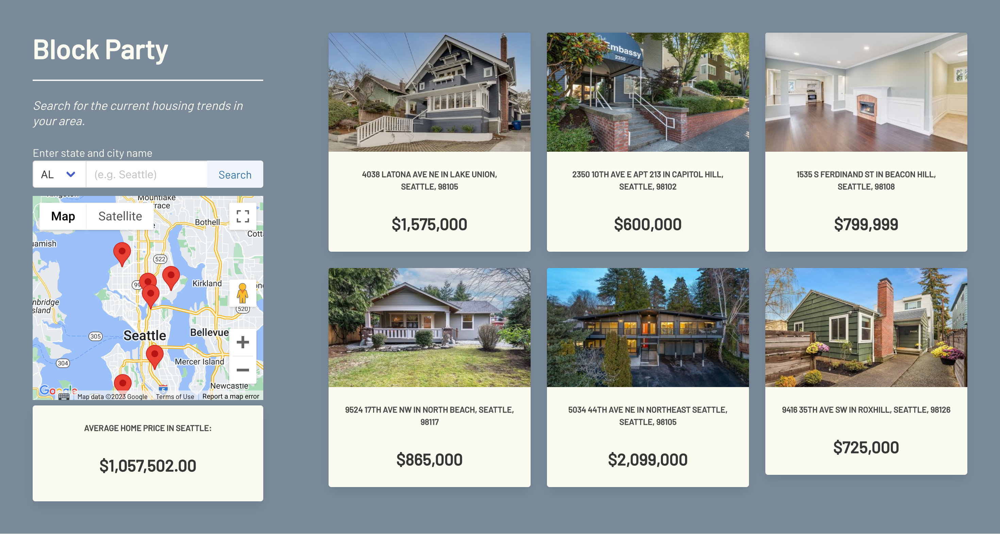
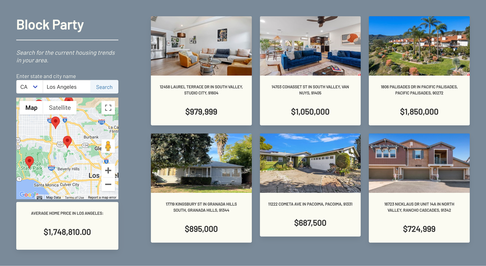
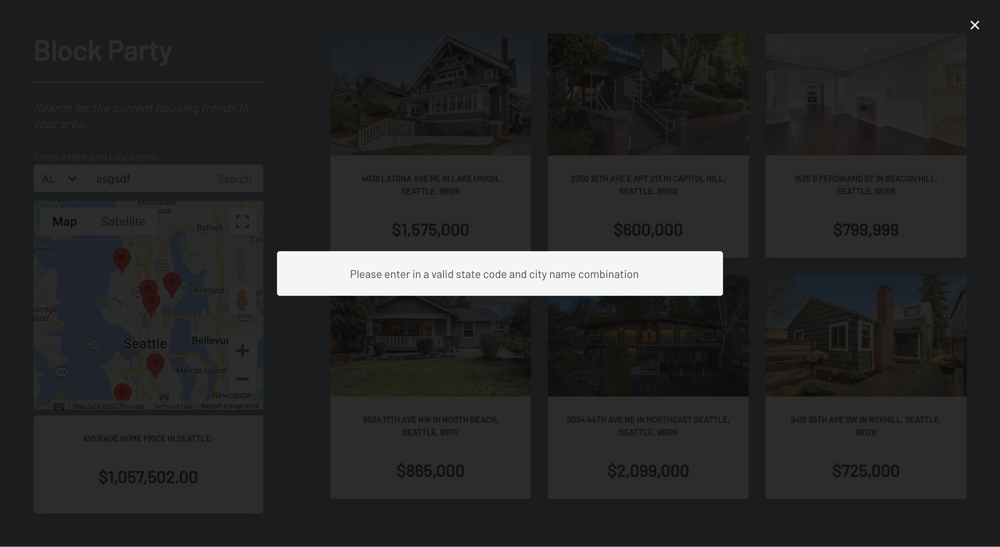
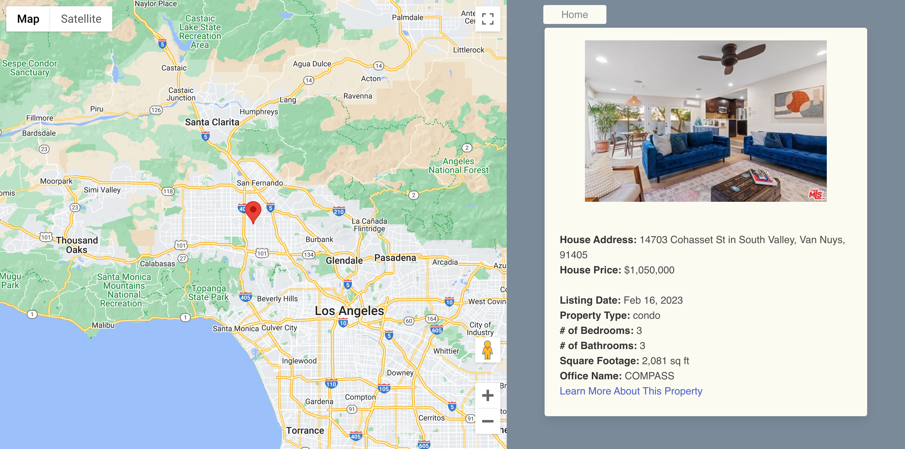

# Block Party
An app that allows users to look at houses for sale in a searched area and see general market trends. 

## Description
This application allows users to search by state code and city to view current housing trends in their area. Users will see current houses for sale including a map that shows the property location. After browsing through the options within the searched city the user can choose to view more details for one property. A list of detailed data is presented as well as a map showing the location. This application is designed to make house shopping easier by providing a wide variety of homes within a desired location.

## Installation
In order to access this web page a working device that has access to the internet and a proper web browser is necessary.

## Usage

- On page load, the user is presented with property listings in their current location. The page displays six different options as well as the average price of home in their city.

- The user then has the option to search by state code and city to provide listings in a desired location. After searching, the user is then prompted with six new options of their searched city. If the user provides an incorrect state code and city combination they will be prompted to correct this error.

- The user can now select one of the six options by clicking on the property card. This brings the user to a new page with a map displaying an exact location of the selected property. A detailed list of data is also provided with optional websites to learn more about the property. The user now has the option to return to the home page to continue searching this city or to restart and search a new one.

## Credits
🌟 ___Jorgen Baertsch___ 🌟  
Email: jorgenpaulmusic@gmail.com  
Github: https://github.com/JpBaer

🌟 ___Brandon Ruano___ 🌟  
Email: bruano@uw.edu  
Github: https://github.com/bruano95

🌟 ___Jeffrey Yeh___ 🌟  
Email: jeffreyyehuw@gmail.com  
Github: https://github.com/ETFruitNinja

🌟 ___Frank Castaneda___ 🌟  
Email: fcastaneda88@live.com  
Github: https://github.com/fcastaneda88

🌟 ___David Solomon___ 🌟  
Email: dksolomon8135@gmail.com  
Github: https://github.com/DKsolomon

Realty-in-US by Api Dojo: https://rapidapi.com/apidojo/api/realty-in-us  
Google Maps API: https://developers.google.com/maps

## License
N/A
